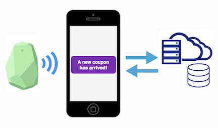
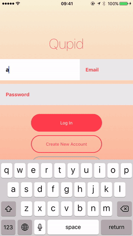

# **Qupid**
Qupid is an IoT-based mobile marketing platform that rethinks the way businesses interact with consumers and reinvigorates the in-store purchasing experience.



Qupid integrates iBeacon technology with an iOS native app and web app to provide a B2C solution that distributes advertisements/coupons to shoppers in real-time, based on their vicinity to the beacons. Business owners are provided data-driven statistics regarding consumer trends while bargain-hunters are rewarded with curated coupons by their favorite brick-and-mortar stores. 

### In this repo:
- Consumer iOS app
- Business iOS scanner
- Business web portal

#### User and Business iOS Features
Live Location-Aware Advertising        | Business Owner QR Scanning Capability 
:-------------------------:|:-------------------------:
  |  

#### Business Portal
Check it out at: http://www.qupid.biz/ !

----

## Team
  - [Blake Fleck](https://github.com/blakeFleck)
  - [James Gu](https://github.com/james-gu)
  - [Susan Hong](https://github.com/keepthemonochrome)
  - [Joshua Peng](https://github.com/pengjoshua)

## Table of Contents
1. [Usage](#usage)
  1. [Consumers](#consumers)
  1. [Business Owners](#business-owners)  
1. [Technologies](#technologies)
1. [Requirements](#requirements)
1. [Installing Dependencies](#installing-dependencies)
  1. [User iOS App](#user-ios-app)
  1. [Business iOS Scanner App](#business-ios-scanner-app)  
1. [Contributing](#contributing)

## Usage
### Consumers
- Create a user account
- Estimote beacons are always "on" (for ~5 years if you were wondering) and constantly emit BLE signals which the Qupid iOS app listens for
- When within close proximity with beacon, you will receive a coupon if there exists an active coupon related to the beacon and you have not already previously received that particular coupon
- Browse through active and used/expired beacon-fetched coupons and sort by date, time to expiration and savings
- When selecting a coupon to use, the app will generate a unique QR code which can be scanned at checkout by the business owner's Scanner App

Sorting | Navigation
:-------------------------:|:-------------------------:
  |   | 

### Business Owners  
- Checkout the business portal prototype here: http://www.qupid.biz/
- Signup for a business owner account
- Login and navigate to the New Coupon screen where coupon metadata can be customized, allowing you to decide what coupons to distribute and when to distribute the coupons via the beacons
- Business owners should install the business scanner app to verify customer coupons at checkout and deem them as used

## Technologies

### Frontend
- React (ES6)
- React-Native
- Redux
- Estimote iBeacons using BLE tech
- Navigation Experimental

### Backend
- Node
- Express
- Business web server written with Universal JavaScript
- MySQL database

### DevOps/Other
- Docker containers
- AWS and Heroku for deployment
- Google Cloud Platform
- Google Cloud SQL
- Selenium
- Late nights and coffee

----------
## Requirements
- React Native ^0.40 (https://facebook.github.io/react-native/docs/getting-started.html) 
- Xcode

## Installing Dependencies
### User iOS App
```sh
git clone https://github.com/conscientiouscucumbers/qupid.git
cd qupid/user_app/client/qupid/
npm install
rnpm link

```
Open project with Xcode within /user_app/client/qupid/ios/
> Note:
> - use Xcode to open qupid.xcodeproj
- ensure iPhone is connected
- may need reconfiguring of personal settings

Using Xcode dashboard:
```sh
select your device (e.g. John Smith)
build project
```

- To manually link RNBeacon.xcodeproj, from /:
```sh
rm user_app/client/qupid/ios/qupid.xcodeproj/RNBeacon.xcodeproj
cp user_app/client/qupid/node_modules/react-native-ibeacon/RNBeacon.xcodeproj user_app/client/qupid/ios/qupid.xcodeproj/
rnpm link
```

> Note:
> - Due to change in how React Native 0.40 includes headers, remove React/ prefix for all RCT*.h files (e.g. RNVectorIconsManager.h)

### Business iOS Scanner App
```sh
git clone https://github.com/conscientiouscucumbers/qupid.git
cd qupid/user_app/client/qupid/
npm install
```
From within /biz_app/scanner/ios/
> Note:
> - use Xcode to open scanner.xcodeproj

Using Xcode dashboard:
```sh
select your device (e.g. John Smith)
build project
```
----------

## Contributing

See [CONTRIBUTING.md](CONTRIBUTING.md) for contribution guidelines.
